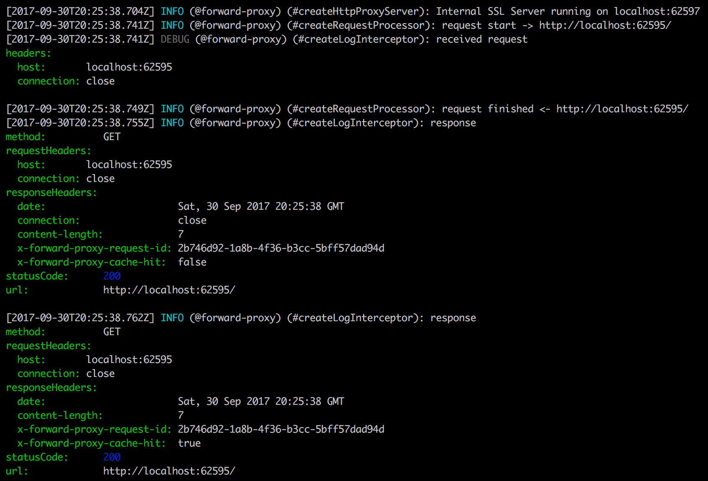

# Roarr

[](https://www.npmjs.org/package/roarr)
[](https://github.com/gajus/canonical)
[](https://twitter.com/kuizinas)

JSON logger for Node.js and browser.

## Motivation

For a long time I have been a big fan of using [`debug`](https://github.com/visionmedia/debug). `debug` is simple to use, works in Node.js and browser, does not require configuration and it is fast. However, problems arise when you need to parse logs. Anything but one-line text messages cannot be parsed in a safe way.

To log structured data, I have been using [Winston](https://github.com/winstonjs/winston) and [Bunyan](https://github.com/trentm/node-bunyan). These packages are great for application-level logging. I have preferred Bunyan because of the [Bunyan CLI program](https://github.com/trentm/node-bunyan#cli-usage) used to pretty-print logs. However, these packages require program-level configuration – when constructing an instance of a logger, you need to define the transport and the log-level. This makes them unsuitable for use in code designed to be consumed by other applications.

Then there is [pino](https://github.com/pinojs/pino). pino is fast JSON logger, it has CLI program equivalent to Bunyan, it decouples transports, and it has sane default configuration. Unfortunately, you still need to instantiate logger instance at the application-level. This makes it more suitable for application-level logging just like Winston and Bunyan.

I needed a logger that:

* Does not block the event cycle (=fast).
* Does not require initialization.
* Produces structured data.
* [Decouples transports](#transports).
* Has a [CLI program](#cli-program).
* Works in Node.js and browser.
* Configurable using environment variables.

In other words,

* a logger that I can use in an application code and in dependencies.
* a logger that allows to correlate logs between the main application code and the dependency code.
* a logger that works well with transports in external processes.

Roarr is this logger.

## Usage

### Producing logs

Roarr logger API for producing logs is the same in Node.js and browser.

1. Import `roarr`
2. Use any of the [API](#api) methods to log messages.

Example:

```ts
import {
  Roarr as log,
} from 'roarr';

log('foo');
```

### Consuming logs

Roarr logs are consumed differently in Node.js and browser.

#### Node.js

In Node.js, Roarr logging is disabled by default. To enable logging, you must start program with an environment variable `ROARR_LOG` set to `true`, e.g.

```bash
ROARR_LOG=true node ./index.js
```

All logs will be written to stdout.

#### Browser

In a browser, you must implement `ROARR.write` method to read logs, e.g.

```ts
import {
  ROARR,
} from 'roarr';

ROARR.write = () => {};
```

The API of the `ROARR.write` is:

```ts
(message: string) => void;
```

Example implementation:

```ts
import {
  ROARR,
} from 'roarr';

ROARR.write = (message) => {
  console.log(JSON.parse(message));
};
```

or if you are initializing `ROARR.write` _before_ `roarr` is loaded:

```ts
// Ensure that `globalThis.ROARR` is configured.
const ROARR = globalThis.ROARR = globalThis.ROARR || {};

ROARR.write = (message) => {
  console.log(JSON.parse(message));
};
```

If your platform does not support [`globalThis`](https://developer.mozilla.org/en-US/docs/Web/JavaScript/Reference/Global_Objects/globalThis), use [`globalthis` polyfill](https://www.npmjs.com/package/globalthis).

You may also use [`@roarr/browser-log-writer`](https://github.com/gajus/roarr-browser-log-writer) that implements and opinionated browser logger with [Liqe](https://github.com/gajus/liqe) query support for filtering logs.

### Filtering logs

#### Node.js

In Node.js, Roarr prints all or none logs (refer to the [`ROARR_LOG` environment variable](#environment-variables) documentation).

Use [`@roarr/cli` program](https://github.com/gajus/roarr-cli#filtering-logs) to filter logs, e.g.

```bash
ROARR_LOG=true node ./index.js | roarr --filter 'context.logLevel:>30'
```

#### Browser

In a browser, Roarr calls `globalThis.ROARR.write` for every log message. Implement your own custom logic to filter logs, e.g.

```ts
globalThis.ROARR.write = (message) => {
  const payload = JSON.parse(message);

  if (payload.context.logLevel > 30) {
    console.log(payload);
  }
};
```

## Log message format

|Property name|Contents|
|---|---|
|`context`|Arbitrary, user-provided structured data. See [context property names](#context-property-names).|
|`message`|User-provided message formatted using [printf](https://en.wikipedia.org/wiki/Printf_format_string).|
|`sequence`|Incremental sequence ID (see [`adopt`](#adopt) for description of the format and its meaning).|
|`time`|Unix timestamp in milliseconds.|
|`version`|Roarr log message format version.|

Example:

```json
{
  "context": {
    "application": "task-runner",
    "hostname": "curiosity.local",
    "instanceId": "01BVBK4ZJQ182ZWF6FK4EC8FEY",
    "taskId": 1
  },
  "message": "starting task ID 1",
  "sequence": "0",
  "time": 1506776210000,
  "version": "1.0.0"
}
```

## API

`roarr` package exports a function with the following API:

```ts
export type Logger =
  (
    context: MessageContext,
    message: string,
    c?: SprintfArgument,
    d?: SprintfArgument,
    e?: SprintfArgument,
    f?: SprintfArgument,
    g?: SprintfArgument,
    h?: SprintfArgument,
    i?: SprintfArgument,
    k?: SprintfArgument
  ) => void |
  (
    message: string,
    b?: SprintfArgument,
    c?: SprintfArgument,
    d?: SprintfArgument,
    e?: SprintfArgument,
    f?: SprintfArgument,
    g?: SprintfArgument,
    h?: SprintfArgument,
    i?: SprintfArgument,
    k?: SprintfArgument
  ) => void;
```

To put it into words:

* First parameter can be either a string (message) or an object.
  * If first parameter is an object (context), the second parameter must be a string (message).
* Arguments after the message parameter are used to enable [printf message formatting](https://en.wikipedia.org/wiki/Printf_format_string).
  * Printf arguments must be of a primitive type (`string | number | boolean | null`).
  * There can be up to 9 printf arguments (or 8 if the first parameter is the context object).

Refer to the [Usage documentation](#usage) for common usage examples.

### `adopt`

```ts
<T>(routine: () => Promise<T>, context: MessageContext | TransformMessageFunction<MessageContext>) => Promise<T>,
```

`adopt` function uses Node.js [`async_context`](https://nodejs.org/api/async_context.html) to pass-down context properties.

When using `adopt`, context properties will be added to all _all_ Roarr messages within the same asynchronous context, e.g.

```ts
log.adopt(
  () => {
    log('foo 0');

    log.adopt(
      () => {
        log('foo 1');
      },
      {
        baz: 'baz 1',
      },
    );
  },
  {
    bar: 'bar 0',
  },
);
```

```json
{"context":{"bar":"bar 0"},"message":"foo 0","sequence":"0","time":1506776210000,"version":"2.0.0"}
{"context":{"bar":"bar 0","baz":"baz 1"},"message":"foo 1","sequence":"0.0","time":1506776210000,"version":"2.0.0"}
```

#### `sequence` value

`sequence` represents async context hierarchy in [`ltree`](https://www.postgresql.org/docs/current/ltree.html) format, i.e.

```xml
<top-level sequential invocation ID>[.<async operation sequential invocation ID>]
```

Members of sequence value represent log index relative to the async execution context. This information can be used to establish the origin of the log invocation in an asynchronous context, e.g.

```ts
log.adopt(() => {
  log('foo 0');
  log.adopt(() => {
    log('bar 0');
    log.adopt(() => {
      log('baz 0');
      setTimeout(() => {
        log('baz 1');
      }, 10);
    });
    log('bar 1');
  });
});
```

```json
{"context":{},"message":"foo 0","sequence":"0.0","time":1506776210000,"version":"2.0.0"}
{"context":{},"message":"bar 0","sequence":"0.1.0","time":1506776210000,"version":"2.0.0"}
{"context":{},"message":"baz 0","sequence":"0.1.1.0","time":1506776210000,"version":"2.0.0"}
{"context":{},"message":"bar 1","sequence":"0.1.2","time":1506776210000,"version":"2.0.0"}
{"context":{},"message":"baz 1","sequence":"0.1.1.1","time":1506776210010,"version":"2.0.0"}
```

Notice that even though logs `baz 0` and `baz 1` were produced at different times, you can tell that one was produced after another by looking at their sequence values `0.1.1.0` and `0.1.1.1`.

#### Requirements

* `adopt` method only works in Node.js.

### `child`

The `child` function has two signatures:

1. Accepts an object.
2. Accepts a function.

#### Object parameter

```ts
(context: MessageContext): Logger,
```

Creates a child logger that appends child `context` to every subsequent message.

Example:

```ts
import {
  Roarr as log,
} from 'roarr';

const barLog = log.child({
  foo: 'bar'
});

log.debug('foo 1');

barLog.debug('foo 2');
```

```json
{"context":{"logLevel":20},"message":"foo 1","sequence":"0","time":1506776210000,"version":"2.0.0"}
{"context":{"foo":"bar","logLevel":20},"message":"foo 2","sequence":"1","time":1506776210000,"version":"2.0.0"}
```

#### Function parameter

```ts
<T>(context: TransformMessageFunction<MessageContext<T>>): Logger<T>
```

Creates a child logger that translates every subsequent message.

Example:

```ts
import {
  Roarr as log,
} from 'roarr';

const barLog = log.child<{error: Error}>((message) => {
  return {
    ...message,
    context: {
      ...message.context,
      ...message.context.error && {
        error: {
          message: message.context.error.message,
        },
      },
    },
  };
});

log.debug('foo 1');

barLog.debug({
  error: new Error('bar'),
}, 'foo 2');
```

```json
{"context":{"logLevel":20},"message":"foo 1","sequence":"0","time":1506776210000,"version":"2.0.0"}
{"context":{"logLevel":20,"error":{"message":"bar"}},"message":"bar 2","sequence":"1","time":1506776210000,"version":"2.0.0"}
```

A typical use case for this pattern is serialization (e.g. of HTTP request, response or error object) and redaction of sensitive data from logs.

### `getContext`

Returns the current context.

Example:

```ts
import {
  Roarr as log,
} from 'roarr';

const childLogger = log.child({
  foo: 'bar'
});

childLogger.getContext();

// {foo: 'bar'}
```

### `trace`
### `debug`
### `info`
### `warn`
### `error`
### `fatal`

Convenience methods for logging a message with `logLevel` context property value set to a numeric value representing the [log level](#log-levels), e.g.

```ts
import {
  Roarr as log,
} from 'roarr';

log.trace('foo');
log.debug('foo');
log.info('foo');
log.warn('foo');
log.error('foo');
log.fatal('foo');
```

Produces output:

```json
{"context":{"logLevel":10},"message":"foo","sequence":"0","time":1506776210000,"version":"2.0.0"}
{"context":{"logLevel":20},"message":"foo","sequence":"1","time":1506776210000,"version":"2.0.0"}
{"context":{"logLevel":30},"message":"foo","sequence":"2","time":1506776210000,"version":"2.0.0"}
{"context":{"logLevel":40},"message":"foo","sequence":"3","time":1506776210000,"version":"2.0.0"}
{"context":{"logLevel":50},"message":"foo","sequence":"4","time":1506776210000,"version":"2.0.0"}
{"context":{"logLevel":60},"message":"foo","sequence":"5","time":1506776210000,"version":"2.0.0"}
```

### `traceOnce`
### `debugOnce`
### `infoOnce`
### `warnOnce`
### `errorOnce`
### `fatalOnce`

Just like the regular logger methods, but logs the message only once.

Note: Internally, Roarr keeps a record of the last 1,000 `Once` invocations. If this buffer overflows, then the message is going to be logged again until the next time the buffer overflows again. 

## Utilities

### `getLogLevelName`

Provides log level name (trace, debug, ...) for a numeric log level (10, 20, ...).

If numeric log level is between two ranges, then resolves to the one with greater severity (e.g. 5 => trace).

If numeric log level is greater than the maximum supported, then falls back to the greatest severity (fatal).

```ts
import {
  getLogLevelName,
} from 'roarr';
import type {
  LogLevelName,
} from 'roarr';

getLogLevelName(numericLogLevel: number): LogLevelName;
```

## Middlewares

Roarr logger supports middlewares implemented as [`child`](#child) message translate functions, e.g.

```ts
import {
  Roarr as log,
} from 'roarr';
import createSerializeErrorMiddleware from '@roarr/middleware-serialize-error';

const childLog = log.child(createSerializeErrorMiddleware());

const error = new Error('foo');

log.debug({error}, 'bar');
childLog.debug({error}, 'bar');
```

```json
{"context":{"logLevel":20,"error":{}},"message":"bar","sequence":"0","time":1506776210000,"version":"2.0.0"}
{"context":{"logLevel":20,"error":{"name":"Error","message":"foo","stack":"[REDACTED]"}},"message":"bar","sequence":"1","time":1506776210000,"version":"2.0.0"}
```

Roarr middlewares enable translation of every bit of information that is used to construct a log message.

The following are the official middlewares:

* [`@roarr/middleware-serialize-error`](https://github.com/gajus/roarr-middleware-serialize-error)

Raise an issue to add your middleware of your own creation.

## CLI program

Roarr CLI program provides ability to filter and pretty-print Roarr logs.



CLI program has been moved to a separate package [`@roarr/cli`](https://github.com/gajus/roarr-cli).

```bash
npm install @roarr/cli -g
```

Explore all CLI commands and options using `roarr --help` or refer to [`@roarr/cli`](https://github.com/gajus/roarr-cli) documentation.

## Transports

A transport in most logging libraries is something that runs in-process to perform some operation with the finalized log line. For example, a transport might send the log line to a standard syslog server after processing the log line and reformatting it.

Roarr does not support in-process transports.

Roarr does not support in-process transports because Node processes are single threaded processes (ignoring some technical details). Given this restriction, Roarr purposefully offloads handling of the logs to external processes so that the threading capabilities of the OS can be used (or other CPUs).

Depending on your configuration, consider one of the following log transports:

* [Beats](https://www.elastic.co/products/beats) for aggregating at a process level (written in Go).
* [logagent](https://github.com/sematext/logagent-js) for aggregating at a process level (written in JavaScript).
* [Fluentd](https://www.fluentd.org/) for aggregating logs at a container orchestration level (e.g. Kubernetes) (written in Ruby).

## Node.js environment variables

Use environment variables to control `roarr` behavior.

|Name||Function|Default|
|---|---|---|---|
|`ROARR_LOG`|Boolean|Enables/ disables logging.|`false`|
|`ROARR_STREAM`|`STDOUT`, `STDERR`|Name of the stream where the logs will be written.|`STDOUT`|

When using `ROARR_STREAM=STDERR`, use [`3>&1 1>&2 2>&3 3>&-`](https://stackoverflow.com/a/2381643/368691) to pipe stderr output.

## Conventions

### Context property names

Roarr does not have reserved context property names. However, I encourage use of the following conventions:

|Context property name|Use case|
|---|---|
|`application`|Name of the application (do not use in code intended for distribution; see `package` property instead).|
|`logLevel`|A numeric value indicating the [log level](#log-levels). See [API](#api) for the build-in loggers with a pre-set log-level.|
|`namespace`|Namespace within a package, e.g. function name. Treat the same way that you would construct namespaces when using the [`debug`](https://github.com/visionmedia/debug) package.|
|`package`|Name of the NPM package.|

The `roarr pretty-print` [CLI program](#cli-program) is using the context property names suggested in the conventions to pretty-print the logs for the developer inspection purposes.

#### Log levels

The `roarr pretty-print` [CLI program](#cli-program) translates `logLevel` values to the following human-readable names:

|`logLevel`|Human-readable name|
|---|---|
|10|TRACE|
|20|DEBUG|
|30|INFO|
|40|WARN|
|50|ERROR|
|60|FATAL|

### Using Roarr in an application

To avoid code duplication, you can use a singleton pattern to export a logger instance with predefined context properties (e.g. describing the application).

I recommend to create a file `Logger.js` in the project directory. Inside this file create and export a child instance of Roarr with context parameters describing the project and the script instance, e.g.

```ts
/**
 * @file Example contents of a Logger.js file.
 */

import {
  Roarr,
} from 'roarr';

export const Logger = Roarr.child({
  // .foo property is going to appear only in the logs that are created using
  // the current instance of a Roarr logger.
  foo: 'bar'
});
```

Roarr does not have reserved context property names. However, I encourage use of the [conventions](#conventions).

## Recipes

### Overriding message serializer

Roarr is opinionated about how it serializes (converts objects to JSON string) log messages, e.g. in Node.js it uses a schema based serializer, which is very fast, but does not allow custom top-level properties.

You can override this serializer by defining `ROARR.serializeMessage`:

```ts
import type {
  MessageEventHandler,
} from 'roarr';

const ROARR = globalThis.ROARR = globalThis.ROARR || {};

const serializeMessage: MessageEventHandler = (message) => {
  return JSON.stringify(message);
};

ROARR.serializeMessage = serializeMessage;
```

### Logging errors

This is not specific to Roarr – this suggestion applies to any kind of logging.

If you want to include an instance of [`Error`](https://developer.mozilla.org/en-US/docs/Web/JavaScript/Reference/Global_Objects/Error) in the context, you must serialize the error.

The least-error prone way to do this is to use an existing library, e.g. [`serialize-error`](https://www.npmjs.com/package/serialize-error).

```ts
import {
  Roarr as log,
} from 'roarr';
import serializeError from 'serialize-error';

// [..]

send((error, result) => {
  if (error) {
    log.error({
      error: serializeError(error)
    }, 'message not sent due to a remote error');

    return;
  }

  // [..]
});
```

Without using serialization, your errors will be logged without the error name and stack trace.

## Anti-patterns

### Overriding `globalThis.ROARR.write` in Node.js

Overriding `globalThis.ROARR.write` in Node.js works the same way as it down in [browser](#browser). However, overriding `ROARR.write` in Node.js is considered an anti-pattern because it defeats some of the major benefits outlined in [Motivation](https://github.com/gajus/roarr#motivation) section of the documentation. Namely, by overriding `ROARR.write` in Node.js you are adding blocking events to the event cycle and coupling application logic with log handling logic.

If you have a use case that asks for overriding `ROARR.write` in Node.js, then [raise an issue](https://github.com/gajus/roarr/issues) to discuss your requirements.

## Integrations

### Using with Sentry

https://github.com/gajus/roarr-sentry

### Using with Fastify

https://github.com/gajus/roarr-fastify

### Using with Elasticsearch

If you are using [Elasticsearch](https://www.elastic.co/products/elasticsearch), you will want to create an [index template](https://www.elastic.co/guide/en/elasticsearch/reference/current/indices-templates.html).

The following serves as the ground work for the index template. It includes the main Roarr log message properties (context, message, time) and the context properties suggested in the [conventions](#conventions).

```json
{
  "mappings": {
    "log_message": {
      "_source": {
        "enabled": true
      },
      "dynamic": "strict",
      "properties": {
        "context": {
          "dynamic": true,
          "properties": {
            "application": {
              "type": "keyword"
            },
            "hostname": {
              "type": "keyword"
            },
            "instanceId": {
              "type": "keyword"
            },
            "logLevel": {
              "type": "integer"
            },
            "namespace": {
              "type": "text"
            },
            "package": {
              "type": "text"
            }
          }
        },
        "message": {
          "type": "text"
        },
        "time": {
          "format": "epoch_millis",
          "type": "date"
        }
      }
    }
  },
  "template": "logstash-*"
}
```

### Using with Scalyr

If you are using [Scalyr](https://www.scalyr.com/), you will want to create a custom parser `RoarrLogger`:

```ts
{
  patterns: {
    tsPattern: "\\w{3},\\s\\d{2}\\s\\w{3}\\s\\d{4}\\s[\\d:]+",
    tsPattern_8601: "\\d{4}-\\d{2}-\\d{2}T[\\d:.]+Z"
  }
  formats: [
    {format: "${parse=json}$"},
    {format: ".*\"time\":$timestamp=number$,.*"},
    {format: "$timestamp=tsPattern$ GMT $detail$"},
    {format: "$timestamp=tsPattern_8601$ $detail$"}
  ]
}
```

and configure the individual programs to use `RoarrLogger`. In case of Kubernetes, this means adding a `log.config.scalyr.com/attributes.parser: RoarrLogger` annotation to the associated deployment, pod or container.

## Documenting use of Roarr

If your package is using Roarr, include instructions in `README.md` describing how to enable logging, e.g.

```md
## Logging

This project uses [`roarr`](https://www.npmjs.com/package/roarr) logger to log the program's state.

Export `ROARR_LOG=true` environment variable to enable log printing to `stdout`.

Use [`roarr-cli`](https://github.com/gajus/roarr-cli) program to pretty-print the logs.
```

## Developing

Every time a change is made to the logger, one must update `ROARR_VERSION` value in [`./src/config.ts`](./src/config.ts).

Unfortunately, this process cannot be automated because the version number is not known before `semantic-version` is called.
